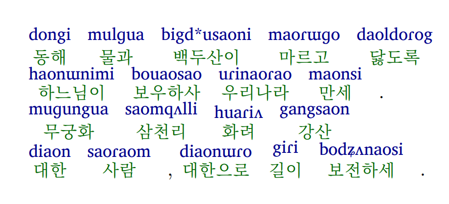

# Korean to Pronunciation Converter (韩语发音转换器)

This repository provides a Python script to convert Korean text into both IPA (International Phonetic Alphabet) and Pinyin pronunciations, formatted for LaTeX using a custom `\anno` command.  这个仓库提供了一个 Python 脚本，可以将韩语文本转换为 IPA（国际音标）和拼音两种发音形式，并使用自定义的 `\anno` 命令格式化为 LaTeX 可用的格式。

## Usage (使用方法)

The script `ipa_converter.py` offers several options for conversion:  脚本 `ipa_converter.py` 提供了几种转换选项：

1. **Convert to IPA (转换为 IPA):**

   ```bash
   python ipa_converter.py 안녕하세요
   ```

   Output (输出): `\anno{안녕하세요}{ɑnnjʌŋɑsɛjo}`

2. **Convert to Pinyin (转换为拼音):**

   ```bash
   python ipa_converter.py 안녕하세요 -p
   ```

   Output (输出): `\anno{안녕하세요}{aonniʌngaosiio}`

3. **Convert to both IPA and Pinyin (转换为 IPA 和拼音):**

   ```bash
   python ipa_converter.py 안녕하세요 -b
   ```

   Output (输出):
   ```latex
   \anno{안녕하세요}{ɑnnjʌŋɑsɛjo}
   \anno{안녕하세요}{aonniʌngaosiio}
   ```

4. **Convert from a text file (从文本文件转换):**  This allows batch conversion and specifying an output file. 这允许批量转换并指定输出文件。

   ```bash
   python ipa_converter.py -f words.txt -p -o output.txt
   ```

   Example `words.txt` content (示例 `words.txt` 内容):
   ```
   동해 물과 백두산이 마르고 닳도록
   ```

   Example `output.txt` content (示例 `output.txt` 内容):
   ```latex
   \anno{동해}{dongi} \anno{물과}{mulɡua} \anno{백두산이}{bigd*usaoni} \anno{마르고}{maoɾɯɡo} \anno{닳도록}{daoldoɾog}
   ```


## Example in LaTeX (LaTeX 中的示例)

The output is formatted as `\anno{Korean Text}{Pronunciation}`. This is designed for use with the following custom `\anno` command in LaTeX: 输出格式为 `\anno{韩语文本}{发音}`。这是为了配合 LaTeX 中以下自定义的 `\anno` 命令使用：

```latex
\newcommand{\anno}[2]{%
	\stackon[2pt]{%
		{\cntext{\small\textcolor{cncolor}{#1}}}%
	}{{\ipa\small\textcolor{ypacolor}{#2}}}%
	\hspace{0.5em}%
}
```

This command allows you to render Korean text with pronunciation annotations above it, facilitating learning.  这个命令使您能够渲染韩语文本，并在其上方显示发音注释，方便学习。




## Acknowledgements (致谢)

This repository uses the Korean to IPA conversion rules from [stannam/hangul_to_ipa](https://github.com/stannam/hangul_to_ipa).  本仓库使用了 [stannam/hangul_to_ipa](https://github.com/stannam/hangul_to_ipa) 的韩语到 IPA 的转换规则。
